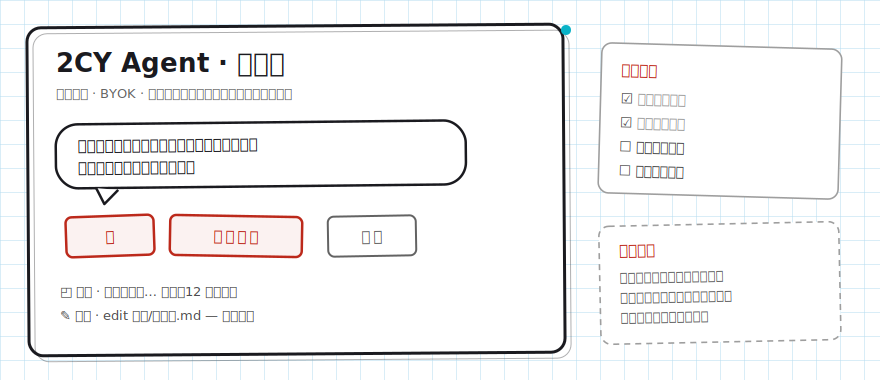

<div align="center">

# 2CY Agent

**A local-first anime companion agent · The Manuscript Desk (BYOK)**

She lives on a black-and-white manuscript desk: in-character when you chat, production-grade when you work.

[](../../releases)
[](../../releases)

[简体中文](./README.md) · **English** · [日本語](./README.ja.md)



</div>

---

## What she does

**Real work, in character.** File read/write and edits, full-text search, long-running tasks, web fetching — production-grade agent capabilities out of the box, all performed by your character in her own voice. Deliverables stay professional; the persona lives only in how she talks to you.

**Storyboard first.** For complex tasks she enters *Storyboard* mode: read-only, she drafts the full plan for your review; only after you approve does she switch to *Inking* and touch anything. She can also dispatch *Doubles* to work in parallel and a *Scout* to research before reporting back.

**Seals as permissions.** Before touching your files, running commands, or fetching beyond scope, she holds up a vermilion seal and waits: **Approve** (once), **Full trust** (this kind, from now on), or **No**. Rules are tunable per pattern; defaults are strict.

**Long chats don't forget.** Context is auto-condensed into a *Recap* card near the limit; *Return to this panel* rolls back both conversation and file changes; long jobs tick along on a *Desk-corner memo*.

**Character cards & long-term memory.** Compatible with legacy `.2cy.json` cards. She remembers your preferences across sessions — stored locally in plaintext, inspectable, deletable, switchable.

**Everything local.** BYOK (dozens of providers supported), no middleman servers, uninstall = delete the folder.

## Install

Grab your platform's zip from [Releases](../../releases):

| Platform | File | Launch |
|---|---|---|
| Windows | `2cy-agent-windows-x64-*.zip` | Double-click `启动-2CY.bat`. If SmartScreen appears: More info → Run anyway (unsigned binary, not malware) |
| macOS (Apple Silicon) | `2cy-agent-darwin-arm64-*.zip` | First run: right-click `启动-2CY.command` → Open (not notarized) |
| Linux | `2cy-agent-linux-x64-*.zip` | `./启动-2CY.sh` |

No Node, Bun, or any runtime required — a single executable; your browser opens automatically.

## Quick start

1. Enter your model API key in the UI (BYOK: OpenAI, Anthropic, DeepSeek, Kimi, GLM, Qwen and dozens more);
2. Chat, or hand her a task: "Turn this folder into a weekly report";
3. For anything complex, start in Storyboard mode and review the plan first.

## Character cards

Drop a card file as `character.2cy.json` into `~/.local/share/2cy/` (Windows: `C:\Users\you\.local\share\2cy\`) — takes effect in new sessions. Or just tell her: "change your catchphrase to ××" — she updates her own card (with your seal). Doubles and Scouts never wear the persona, by design.

## Long-term memory

Facts worth keeping are saved to local `~/.local/share/2cy/memory.json` (plaintext). Maintain it in conversation: "what do you remember about me", "forget #3", "update your impression of me to ××". Can be disabled entirely in settings.

## Skills

Put a `SKILL.md` (plus scripts/assets) under `data/skills/<name>/`. She loads skills on demand — dozens of skills cost only a few lines of resident context — and loading requires your seal. You can even ask her to write skills for herself.

## FAQ

**Why does my antivirus/OS complain?** The binaries are unsigned and un-notarized (cost decision for a personal project). Allow it per the table above, or build from source.

**Does anything get uploaded?** No. Apart from the model API you configure, the app talks to no servers.

## Development

```bash
bun install
bun run dev:web
```

Engineering conventions live in [2CY-FORK.md](./2CY-FORK.md); contributions via [CONTRIBUTING.md](./CONTRIBUTING.md).

